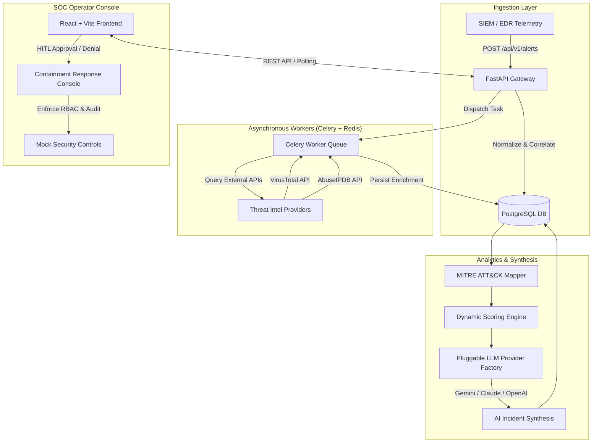

# Autonomous Threat Intelligence & Response Platform (SOAR)

[](https://www.python.org/)
[](https://fastapi.tiangolo.com/)
[](https://react.dev/)
[](https://www.docker.com/)
[](https://attack.mitre.org/)
[](file:///backend/tests)

An enterprise-grade, autonomous Threat Intelligence and Security Orchestration, Automation, and Response (**SOAR**) platform. The system ingests heterogeneous threat telemetry, correlates indicators of compromise (IOCs) into high-fidelity incident cases, enriches indicators asynchronously via multi-provider threat intelligence APIs, maps behavior to the MITRE ATT&CK framework, synthesizes AI-driven analyst summaries, and enforces **Human-in-the-Loop (HITL)** controls before executing network/host containment responses.

---

## Key Capabilities & Features

### 🛡️ Smart Incident Correlation Gateway
- **Automated Case Aggregation**: Correlates incoming alerts into active cases using pre-insertion normalized IOC matching (IP addresses, SHA-256 hashes, domain names).
- **Schema Validation**: Enforces strict Pydantic payload validation for incoming SIEM/EDR alert streams (`POST /api/v1/alerts`).

### ⚡ Asynchronous Threat Intelligence Pipeline
- **Distributed Worker Architecture**: Powered by **Celery** and **Redis** to offload intelligence gathering from synchronous API routes.
- **Multi-Source Enrichment**: Automatically queries external threat intelligence providers (**VirusTotal**, **AbuseIPDB**) with 24-hour database caching, deduplication, and exponential backoff retry handling for HTTP 429 rate limits.

### 🎯 MITRE ATT&CK Engine & Dynamic Incident Scoring
- **Heuristic ATT&CK Mapping**: Matches alert titles and description payloads against MITRE ATT&CK techniques (e.g., `T1021.002` SMB/Windows Admin Shares, `T1003` OS Credential Dumping, `T1110` Brute Force).
- **Multi-Factor Scoring Matrix**: Computes dynamic severity scores (0–100) and tiers (`Critical`, `High`, `Medium`, `Low`) based on indicator reputation scores, technique base weights, and telemetry frequency.

### 🧠 Pluggable AI Incident Summarizer
- **Multi-Model Provider Factory**: Supports **Google Gemini**, **Anthropic Claude**, and **OpenAI** LLM providers with automatic fallback to a local deterministic synthesis engine when API keys are unconfigured.
- **Structured Synthesis Output**: Generates executive summaries, risk & severity rationales, and recommended containment playbooks per incident case.

### 🔒 Human-in-the-Loop (HITL) Containment Console
- **Role-Based Access Control (RBAC)**: Enforces permission gates separating `Analyst` operators (full execution privileges) from `Readonly` roles.
- **Controlled Execution Handlers**: Supports interactive approval/denial workflows for `Block_IP`, `Host_Isolation`, and `Auto_Ticket` actions with mock security control adapters.
- **Immutable Audit Logging**: Logs every operator action, timestamps, target parameters, and denial justifications into a dedicated audit ledger.

### 🖥️ SOC Terminal Visual Dashboard
- **Restrained Dark Aesthetic**: Custom-styled single-page application built with **React**, **Vite**, and **Tailwind CSS** using monospace typography and SOC phosphor green accents.
- **Real-Time Telemetry Polling**: Features real-time status transitions (`pending` → `approved` → `executing` → `executed`) and interactive denial justification modals with feedback toasts.

---

## System Architecture



---

## Technology Stack

| Layer | Component | Technologies Used |
| :--- | :--- | :--- |
| **Backend API** | REST Gateway | Python 3.14+, FastAPI, Uvicorn, Pydantic v2 |
| **Database & ORM** | Relational Ledger | PostgreSQL, SQLAlchemy 2.0, Alembic Migrations |
| **Async Tasks** | Task Broker & Workers | Celery 5.x, Redis 7.x |
| **Threat Intel & AI** | External Integration | VirusTotal API, AbuseIPDB API, Google Gemini, Claude, OpenAI |
| **Frontend UI** | SOC Dashboard | React 18, Vite, Tailwind CSS, Lucide Icons, Google Inter / JetBrains Mono |
| **Containerization** | Infrastructure | Docker, Docker Compose |
| **Quality & Verification**| Test Suite & Automation | Pytest, Playwright, Alembic |

---

## Repository Structure

```
autonomous-threat-intel-platform/
├── backend/
│   ├── alembic/                # Database schema versioning & migration scripts
│   ├── app/
│   │   ├── api/                # REST endpoints (/alerts, /cases, /actions) & schemas
│   │   ├── core/               # App configuration, security, & Celery broker setup
│   │   ├── db/                 # Database engine & session management
│   │   ├── models/             # SQLAlchemy ORM schemas (Case, Alert, IOC, Enrichment, Action)
│   │   ├── services/           # Business logic (Correlation, MITRE Mapper, Scoring, LLM Factory)
│   │   └── workers/            # Celery async worker tasks (Enrichment, Scoring, Summarizer)
│   ├── scripts/                # Verification scripts & reset_demo_data.py
│   ├── tests/                  # Pytest unit & integration test suite (24 tests)
│   └── Dockerfile              # Backend container build definition
├── frontend/
│   ├── src/
│   │   ├── components/         # React UI components (CaseQueue, CaseDetail, ActionWorkflow, Toast)
│   │   ├── App.jsx             # Main router & active case state manager
│   │   └── index.css           # Terminal design system tokens & utility classes
│   ├── Dockerfile              # Frontend container build definition
│   └── package.json            # Node.js dependencies & Vite scripts
├── docs/
│   └── architecture/decisions/ # Architectural Decision Records (ADRs 0001–0007)
├── docker-compose.yml          # Full multi-container orchestration topology
└── Makefile                    # Common development & deployment shortcuts
```

---

## Quick Start & Local Setup

### Prerequisites
- [Docker & Docker Compose](https://docs.docker.com/get-docker/) installed locally.
- *Optional (for local non-containerized dev)*: Python 3.14+, Node.js 18+.

---

### Option 1: Full-Stack Docker Deployment (Recommended)

1. **Clone the Repository**:
   ```bash
   git clone https://github.com/ManvithPanyam/autonomous-threat-intel-platform.git
   cd autonomous-threat-intel-platform
   ```

2. **Configure Environment Variables**:
   ```bash
   cp .env.example .env
   # Edit .env to add optional API keys (VT_API_KEY, ABUSEIPDB_API_KEY, GEMINI_API_KEY)
   ```

3. **Spin Up the Infrastructure**:
   ```bash
   docker compose up --build -d
   ```

4. **Access Applications**:
   - **SOC Analyst Console**: `http://localhost:5173`
   - **FastAPI OpenAPI Docs**: `http://localhost:8000/docs`
   - **Backend Health Check**: `http://localhost:8000/health`

---

### Option 2: Local Standalone Development

1. **Start Backend API & Seed Demo Data**:
   ```bash
   cd backend
   python -m venv venv
   # Windows: venv\Scripts\activate | Linux/macOS: source venv/bin/activate
   pip install -r requirements.txt
   
   # Seed curated demo dataset into database
   python scripts/reset_demo_data.py
   
   # Launch FastAPI Server
   python -m uvicorn app.main:app --port 8000 --reload
   ```

2. **Start Frontend Dashboard**:
   ```bash
   cd frontend
   npm install
   npm run dev -- --port 5173
   ```

---

## REST API Overview

| Method | Endpoint | Description |
| :--- | :--- | :--- |
| `POST` | `/api/v1/alerts/` | Ingest raw alert payload, normalize IOCs, and correlate into cases. |
| `GET` | `/api/v1/cases/` | List incident cases with filtering (`status`, `severity`) and pagination. |
| `GET` | `/api/v1/cases/{id}` | Retrieve case details, AI synthesis, MITRE map, and correlated alerts. |
| `GET` | `/api/v1/cases/{id}/actions` | List containment actions for an incident case. |
| `POST` | `/api/v1/actions/{id}/approve` | Approve containment action execution (Requires Analyst role). |
| `POST` | `/api/v1/actions/{id}/deny` | Deny containment action with mandatory justification reason. |
| `GET` | `/health` | Pre-flight system health status check. |

---

## Automated Verification & Test Suite

The platform includes a comprehensive test suite covering schema validation, case correlation algorithms, enrichment caching boundaries, MITRE mapping heuristics, scoring escalation, and approval access controls.

To run the automated backend test suite:
```bash
cd backend
python -m pytest tests/ -v
```

### Verification Coverage:
```text
tests/test_phase5.py .....  [ 20%]  (Alert ingestion, IOC deduplication & enrichment caching)
tests/test_phase6.py ...    [ 33%]  (MITRE ATT&CK mapping & severity escalation logic)
tests/test_phase7.py .....  [ 54%]  (AI synthesis prompt building & provider fallback chain)
tests/test_phase8.py .....  [ 75%]  (HITL containment workflow, RBAC, & denial audit logging)
tests/test_phase9.py ...... [100%]  (FastAPI route integration & end-to-end response schemas)

======================= 24 passed in 10.17s =======================
```

---

## Architectural Decision Records (ADRs)

Design choices and technical trade-offs are documented in `docs/architecture/decisions/`:
- **[ADR 0001: Alert Schema Design](file:///docs/architecture/decisions/0001-alert-schema-design.md)** - Decoupled alert ingestion model & normalized IOC relationships.
- **[ADR 0002: Containment Action Scope](file:///docs/architecture/decisions/0002-containment-action-scope.md)** - Human-in-the-loop approval requirements for active containment.
- **[ADR 0003: Gemini API Key Configuration](file:///docs/architecture/decisions/0003-gemini-api-key-configuration.md)** - Environment-driven LLM selection and heuristic fallback strategy.
- **[ADR 0004: IOC Normalization & Deduplication](file:///docs/architecture/decisions/0004-ioc-normalization-and-deduplication.md)** - Pre-insertion sanitization rules for IP/Hash/Domain entities.
- **[ADR 0005: Rate Limiting & Caching Policies](file:///docs/architecture/decisions/0005-rate-limiting-and-caching-policies.md)** - 24-hour TTL caching for threat intel API queries.
- **[ADR 0006: MITRE Mapping & Scoring Methodology](file:///docs/architecture/decisions/0006-mitre-mapping-and-scoring-methodology.md)** - Heuristic keyword mapping and multi-factor severity scoring matrix.
- **[ADR 0007: Container Healthchecks & Pre-Flight Policy](file:///docs/architecture/decisions/0007-container-healthchecks-and-preflight-policy.md)** - Compose service topology and pre-flight validation gates.

---

## License

Distributed under the MIT License. See `LICENSE` for details.
